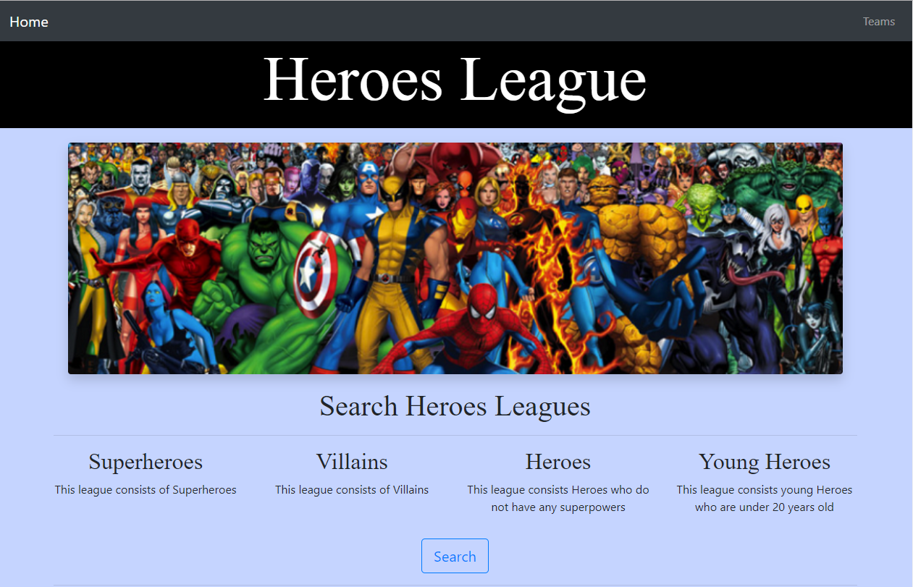
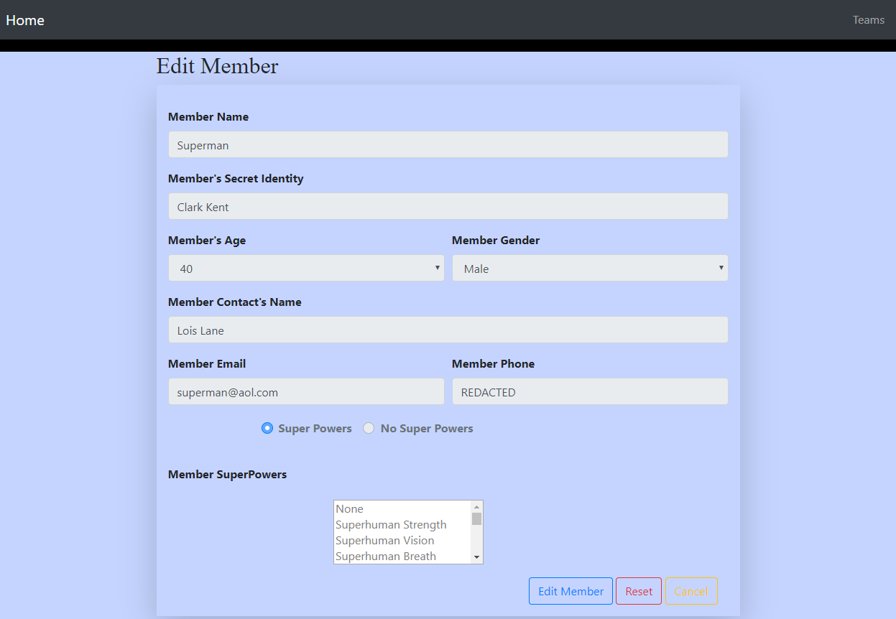
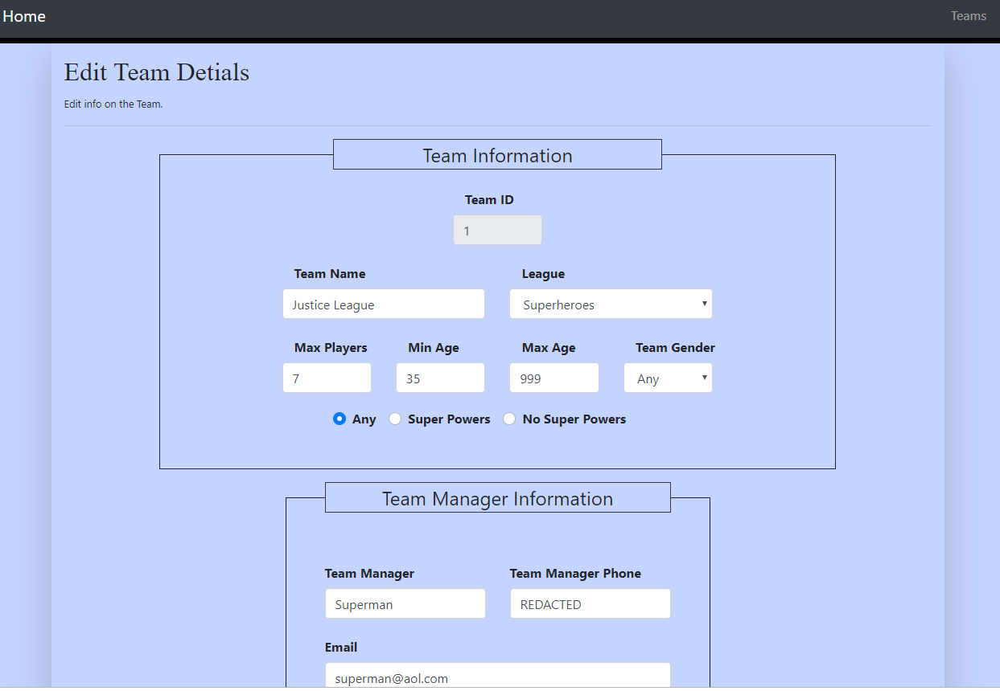

# Welcome to Superfriends!

This is a site to search for heroes and villains. The user is able to search the hero leagues by league or the teams super powers.

# Super Heroes

There is a **variety** of super heroes. This application is to search through super heroes.

- **"Main Page"**
	> Will display a brief paragraph.
    

- **Search Page**
	> The page will display hero teams available based on league search, or team's super powers.
    
	
- **Members** 
	> The user is able to create members and add them to a team.
    
	
- **Teams** 
	> The user is able to create teams and add members.
    

## Audience

- **Primary** - Customers looking to search heroes.

# Setup

Once you have cloned and created a fork from this repo, there is a need to open the **command window** and run the following in the project directory: 

> **`npm install express --save`**
> **`npm install body-parser --save`**

## Start and Stop the Node Server

### Start
To start the node server type into the **command window**:

> **`node server.js`**

### Using
The **command window** will display:

> **`App listening at port 8081`**

To use the site the user will enter [http://localhost:8081/index.html](http://localhost:8081/index.html) into the **browser**:

### Stop
To stop the node server press into the **command window**:

> **`Ctrl + C`**